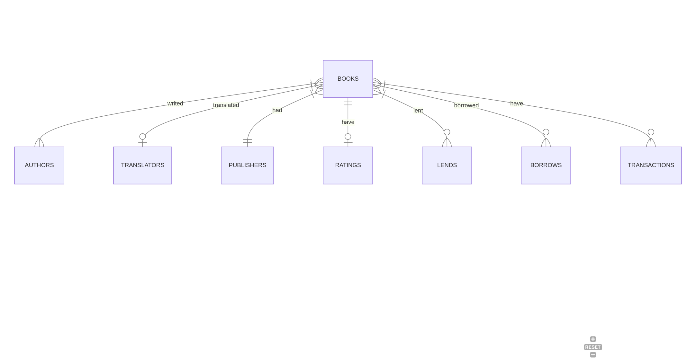

# Design Document

By Pedro de Castro

Video overview: <URL HERE>

## Scope

The purpose of this database is to allow the user to manage a personal library in a simple and effective manner. Includes all the necessary entities to help the user manage their books, loans, and transactions. The database's scope is:

* Books, including a wide range of information about them
* Authors, including basic identifying information
* Translators, including basic identifying information
* Publishers, including basic identifying information
* Book loans, including the type of loan (lend or borrow), the name of people involved, the time at which the loan was made, when the book was returned, as well as fines in case of delay
* Book transactions, including the type of transaction (purchase or sale), the name of people involved, the values, and the time at which the transaction was made

Out of scope are elements like personal information of the people involved, libraries and bookstores.

## Functional Requirements

This database will support:

* CRUD operations for books, authors, translators, publishers, loans and transactions
* Tracking the loans, including when and to whom each book was lent, when and from whom each book was borrowed, and allowing for a single loan with multiple books and with the possibility of having different due dates
* Triggers that automatically update the status of books when they go through a transaction or loan
* Soft deletion: maintains a history of all books that have been sold and borrowed

This database does not support the automatic updating of the total fine amount in case of delay; it needs to be updated manually.

## Representation

### Entities

The database includes the following entities:

#### Authors

The `authors` table includes:

* `id` which specifies the unique ID for the author as an `INTEGER`. This column has the `PRIMARY KEY` constraint applied.
* `first_name`, which specifies the author's first name as `TEXT`.
* `last_name`, which specifies the author's last name as `TEXT`.
* `nationality`, which specifies the author's nationality as `TEXT`.
* `date_of_birth`, which specifies the author's date of birth as `DATE`.

All columns are required except for `nationality` and `date_of_birth`.

#### Translators

The `translators` table includes:

* `id` which specifies the unique ID for the author as an `INTEGER`. This column has the `PRIMARY KEY` constraint applied.
* `first_name`, which specifies the author's first name as `TEXT`.
* `last_name`, which specifies the author's last name as `TEXT`.
* `nationality`, which specifies the author's nationality as `TEXT`.
* `date_of_birth`, which specifies the author's date of birth as `DATE`.

All columns are required except for `nationality` and `date_of_birth`.

#### Publishers

The `publishers` table includes:

* `id`, which specifies the unique ID for the publisher as an `INTEGER`. This column has the `PRIMARY KEY` constraint applied.
* `name`, which specifies the publisher's name as `TEXT`.
* `founded_year`, which specifies the year the publisher was founded as an `INTEGER`.
* `phone_number`, which specifies the publisher's phone number as `TEXT`.
* `email`, which specifies the publisher's email as `TEXT`.
* `website`, which specifies the publisher's website as `TEXT`.

All columns are required except for `founded_year`, `phone_number`, `email`, and `website`.

#### Books

The `books` table includes:

* `id`, which specifies the unique ID for the book as an `INTEGER`. This column has the `PRIMARY KEY` constraint applied.
* `title`, which specifies the book's title as `TEXT`.
* `language`, which specifies the language of the book as `TEXT`.
* `original_language`, which specifies the original language of the book as `TEXT`.
* `year`, which specifies the publication year of the book as an `INTEGER`.
* `edition`, which specifies the edition number of the book as an `INTEGER`.
* `edition_year`, which specifies the year of the edition as an `INTEGER`.
* `category`, which specifies the category of the book as `TEXT`.
* `genre`, which specifies the genre of the book as `TEXT`.
* `rating`, which specifies the rating of the book as a `NUMERIC` value between 0 and 5.
* `location`, which specifies the location of the book (e.g., shelf, kindle) as `TEXT`.
* `is_read`, which indicates if the book has been read as a `BOOLEAN` with a default value of `FALSE`.
* `sold`, which indicates if the book has been sold as a `BOOLEAN` with a default value of `FALSE`.
* `lent`, which indicates if the book has been lent out as a `BOOLEAN` with a default value of `FALSE`.
* `borrowed`, which indicates if the book has been borrowed as a `BOOLEAN` with a default value of `FALSE`.
* `translator_id`, which specifies the ID of the translator as an `INTEGER`. This column has the `FOREIGN KEY` constraint applied, referencing the id column in the translators table.
* `publisher_id`, which specifies the ID of the publisher as an `INTEGER`. This column has the `FOREIGN KEY` constraint applied, referencing the id column in the publishers table.

All columns are required except for `year`, `edition`, `edition_year`, `rating`, and `location`.

#### Authored

The `authored` table is an association table between `authors` and `books` and includes:

* `author_id`, which specifies the ID of the author as an `INTEGER`. This column has the `PRIMARY KEY` constraint applied, and the `FOREIGN KEY` constraint references the id column in the authors table.
* `book_id`, which specifies the ID of the book as an `INTEGER`. This column has the `PRIMARY KEY` constraint applied, and the `FOREIGN KEY` constraint references the id column in the books table.

#### Transactions

The `transactions` table includes:

* `id`, which specifies the unique ID for the transaction as an `INTEGER`. This column has the `PRIMARY KEY` constraint applied.
* `type`, which specifies the type of transaction (either 'purchase' or 'sale') as `TEXT`. This column has a CHECK constraint to ensure valid values.
* `value`, which specifies the value of the transaction as a `NUMERIC`.
* `timestamp`, which specifies the timestamp of the transaction as a `DATETIME` with a default value of CURRENT_TIMESTAMP.
* `entity_type`, which specifies the type of entity involved in the transaction (either 'person' or 'store') as `TEXT`. This column has a CHECK constraint to ensure valid values.
* `entity_name`, which specifies the name of the entity involved in the transaction as `TEXT`.
* `contact`, which specifies the contact information (phone number or email) of the entity as `TEXT`.

All columns are required except for `contact`.

#### Books in Transaction

The `books_in_transaction` table is an association table between `books` and `transactions` and includes:

* `transaction_id`, which specifies the ID of the transaction as an `INTEGER`. This column has the `PRIMARY KEY` constraint applied, and the `FOREIGN KEY` constraint references the id column in the transactions table.
* `book_id`, which specifies the ID of the book as an `INTEGER`. This column has the `PRIMARY KEY` constraint applied, and the `FOREIGN KEY` constraint references the id column in the books table.

#### Lends

The `lends` table includes:

* `id`, which specifies the unique ID for the lend as an `INTEGER`. This column has the `PRIMARY KEY` constraint applied.
* `lend_date`, which specifies the date the book was lent out as a `DATE` with a default value of CURRENT_DATE.
* `borrower_name`, which specifies the name of the borrower as `TEXT`.

All columns are required.

#### Books on Lend

The `books_on_lend` table is an association table between `lends` and `books` and includes:

* `lend_id`, which specifies the ID of the lend as an `INTEGER`. This column has the `PRIMARY KEY` constraint applied, and the `FOREIGN KEY` constraint references the id column in the lends table.
* `book_id`, which specifies the ID of the book as an `INTEGER`. This column has the `PRIMARY KEY` constraint applied, and the `FOREIGN KEY` constraint references the id column in the books table.
* `due_date`, which specifies the due date for the return of the book as a `DATE`.
* `return_date`, which specifies the actual return date of the book as a `DATE`.

#### Borrows

The `borrows` table includes:

* `id`, which specifies the unique ID for the borrow as an `INTEGER`. This column has the `PRIMARY KEY` constraint applied.
* `entity_type`, which specifies the type of entity involved in the borrow (either 'person' or 'library') as `TEXT`. This column has a CHECK constraint to ensure valid values.
* `entity_name`, which specifies the name of the entity involved in the borrow as `TEXT`.
* `borrow_date`, which specifies the date the book was borrowed as a `DATE` with a default value of CURRENT_DATE.
* `fine_per_day`, which specifies the fine per day for late return as a `NUMERIC`. This column has a CHECK constraint to ensure non-negative values.
* `total_fine`, which specifies the total fine accrued for late return as a `NUMERIC`. This column has a CHECK constraint to ensure non-negative values.

All columns are required except for `due_date` and `return_date`.

#### Books on Borrow

The `books_on_borrow` table is an association table between `borrows` and `books` and includes:

* `borrow_id`, which specifies the ID of the borrow as an `INTEGER`. This column has the `PRIMARY KEY` constraint applied, and the `FOREIGN KEY` constraint references the id column in the borrows table.
* `book_id`, which specifies the ID of the book as an `INTEGER`. This column has the `PRIMARY KEY` constraint applied, and the `FOREIGN KEY` constraint references the id column in the books table.
* `due_date`, which specifies the due date for the return of the book as a `DATE`.
* `return_date`, which specifies the actual return date of the book as a `DATE`.

### Relationships

As detailed by the diagram:

* A book is written by one or many authors. Likewise, an author can write one or many books.
* A book can be translated by one and only one translator. Otherwise, a translator can translate one or many books.
* A book can be published by one and only one publisher. Whereas, a publisher can publish one or many books.
* A book can be loaned (lent or borrowed) in 0 to many loans. At same time, a loan (lend or borrow) can involve one or many books.
* A book is associated with 0 or many transactions. At same time, a transaction can involve one or many books.

## Optimizations

In this section you should answer the following questions:

* Which optimizations (e.g., indexes, views) did you create? Why?

## Limitations

In this section you should answer the following questions:

* What are the limitations of your design?
* What might your database not be able to represent very well?