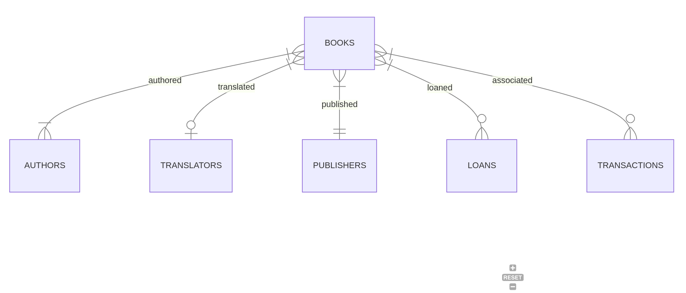

# Design Document

By Pedro de Castro

Video overview: <URL HERE>

## Scope

The purpose of this database is to allow the user to manage a personal library in a simple and effective manner. Includes all the necessary entities to help the user manage their books, loans, and transactions. The database's scope is:

* Books, including a wide range of information about them
* Authors, including basic identifying information
* Translators, including basic identifying information
* Publishers, including basic identifying information
* Book loans, including the type of loan (lend or borrow), the name of people/library involved, the time at which the loan was made, when the book was returned, as well as fines in case of delay
* Book transactions, including the type of transaction (purchase or sale), the name of people/bookstore involved, the values, and the time at which the transaction was made

Elements like personal information of the people involved, as well as information about libraries and bookstores, are out of scope.

## Functional Requirements

This database will support:

* CRUD operations for books, authors, translators, publishers, loans and transactions
* Tracking the loans, including when and to whom each book was lent, when and from whom each book was borrowed, and allowing for a single loan with multiple books and with the possibility of having different due dates
* Triggers that automatically update the status of books when they go through a transaction or loan
* Soft deletion: maintains a history of all books that have been sold and borrowed

This database does not support the automatic updating of the total fine amount in case of delay; it needs to be updated manually.

## Representation

### Entities

The database includes the following entities:

#### Authors

The `authors` table includes:

* `id` which specifies the unique ID for the author as an `INTEGER`. This column has the `PRIMARY KEY` constraint applied.
* `first_name`, which specifies the author's first name as `TEXT`.
* `last_name`, which specifies the author's last name as `TEXT`.
* `nationality`, which specifies the author's nationality as `TEXT`.
* `date_of_birth`, which specifies the author's date of birth as `DATE`.

All columns are required except for `nationality` and `date_of_birth`.

#### Translators

The `translators` table includes:

* `id` which specifies the unique ID for the author as an `INTEGER`. This column has the `PRIMARY KEY` constraint applied.
* `first_name`, which specifies the author's first name as `TEXT`.
* `last_name`, which specifies the author's last name as `TEXT`.
* `nationality`, which specifies the author's nationality as `TEXT`.
* `date_of_birth`, which specifies the author's date of birth as `DATE`.

All columns are required except for `nationality` and `date_of_birth`.

#### Publishers

The `publishers` table includes:

* `id`, which specifies the unique ID for the publisher as an `INTEGER`. This column has the `PRIMARY KEY` constraint applied.
* `name`, which specifies the publisher's name as `TEXT`.
* `founded_year`, which specifies the year the publisher was founded as an `INTEGER`.
* `phone_number`, which specifies the publisher's phone number as `TEXT`.
* `email`, which specifies the publisher's email as `TEXT`.
* `website`, which specifies the publisher's website as `TEXT`.

All columns are required except for `founded_year`, `phone_number`, `email`, and `website`.

#### Books

The `books` table includes:

* `id`, which specifies the unique ID for the book as an `INTEGER`. This column has the `PRIMARY KEY` constraint applied.
* `title`, which specifies the book's title as `TEXT`.
* `language`, which specifies the language of the book as `TEXT`.
* `original_language`, which specifies the original language of the book as `TEXT`.
* `year`, which specifies the publication year of the book as an `INTEGER`.
* `edition`, which specifies the edition number of the book as an `INTEGER`.
* `edition_year`, which specifies the year of the edition as an `INTEGER`.
* `category`, which specifies the category of the book as `TEXT`.
* `genre`, which specifies the genre of the book as `TEXT`.
* `rating`, which specifies the rating of the book as a `NUMERIC` value between 0 and 5.
* `location`, which specifies the location of the book (e.g., shelf, kindle) as `TEXT`.
* `isbn`, which represents the International Standart Book Number as `TEXT`. 
* `is_read`, which indicates if the book has been read as a `BOOLEAN` with a default value of `FALSE`.
* `sold`, which indicates if the book has been sold as a `BOOLEAN` with a default value of `FALSE`.
* `lent`, which indicates if the book has been lent out as a `BOOLEAN` with a default value of `FALSE`.
* `borrowed`, which indicates if the book has been borrowed as a `BOOLEAN` with a default value of `FALSE`.
* `translator_id`, which specifies the ID of the translator as an `INTEGER`. This column has the `FOREIGN KEY` constraint applied, referencing the id column in the translators table.
* `publisher_id`, which specifies the ID of the publisher as an `INTEGER`. This column has the `FOREIGN KEY` constraint applied, referencing the id column in the publishers table.

All columns are required except for `year`, `edition`, `edition_year`, `rating`, `location` and `isbn`.

#### Authored

The `authored` table is an association table between `authors` and `books` and includes:

* `author_id`, which specifies the ID of the author as an `INTEGER`. This column has the `PRIMARY KEY` constraint applied, and the `FOREIGN KEY` constraint references the id column in the authors table.
* `book_id`, which specifies the ID of the book as an `INTEGER`. This column has the `PRIMARY KEY` constraint applied, and the `FOREIGN KEY` constraint references the id column in the books table.

#### Transactions

The `transactions` table includes:

* `id`, which specifies the unique ID for the transaction as an `INTEGER`. This column has the `PRIMARY KEY` constraint applied.
* `type`, which specifies the type of transaction (either 'purchase' or 'sale') as `TEXT`. This column has a CHECK constraint to ensure valid values.
* `value`, which specifies the value of the transaction as a `NUMERIC`.
* `timestamp`, which specifies the timestamp of the transaction as a `DATETIME` with a default value of CURRENT_TIMESTAMP.
* `entity_type`, which specifies the type of entity involved in the transaction (either 'person' or 'store') as `TEXT`. This column has a CHECK constraint to ensure valid values.
* `entity_name`, which specifies the name of the entity involved in the transaction as `TEXT`.
* `contact`, which specifies the contact information (phone number or email) of the entity as `TEXT`.

All columns are required except for `contact`.

#### Books in Transaction

The `books_in_transaction` table is an association table between `books` and `transactions` and includes:

* `transaction_id`, which specifies the ID of the transaction as an `INTEGER`. This column has the `PRIMARY KEY` constraint applied, and the `FOREIGN KEY` constraint references the id column in the transactions table.
* `book_id`, which specifies the ID of the book as an `INTEGER`. This column has the `PRIMARY KEY` constraint applied, and the `FOREIGN KEY` constraint references the id column in the books table.

#### Loans

The `loans` table includes:

* `id`, which specifies the unique ID for the loan as an `INTEGER`. This column has the `PRIMARY KEY` constraint applied.
* `loan_date`, which specifies the date the book was loaned out, is stored as a `DATE` with a default value of CURRENT_DATE.
* `type`, which specifies the type of loan (either 'lend' or 'borrow') as `TEXT`. This column has a CHECK constraint to ensure valid values.
* `loaner_type`, which specifies the type of loaner (either 'person' or 'library') as `TEXT`. This column has a CHECK constraint to ensure valid values.
* `loaner_name`, which specifies the name of the loaner as `TEXT`.
* `fine_per_day`, which specifies the fine per day for late return as a `NUMERIC`. This column has a CHECK constraint to ensure non-negative values.
* `total_fine`, which specifies the total fine accrued for late return as a `NUMERIC`. This column has a CHECK constraint to ensure non-negative values.

#### Books on Loan

The `books_on_loan` table is an association table between `loans` and `books` and includes:

* `loan_id`, which specifies the ID of the loan as an `INTEGER`. This column has the `PRIMARY KEY` constraint applied, and the `FOREIGN KEY` constraint references the id column in the lends table.
* `book_id`, which specifies the ID of the book as an `INTEGER`. This column has the `PRIMARY KEY` constraint applied, and the `FOREIGN KEY` constraint references the id column in the books table.
* `due_date`, which specifies the due date for the return of the book as a `DATE`.
* `return_date`, which specifies the actual return date of the book as a `DATE`.

### Relationships

The below entity relationship diagram describes the relationships among the entities in the database.

As detailed by the diagram:

* A book is written by one or many authors. Likewise, an author can write one or many books.
* A book can be translated by 0 or only one translator. Otherwise, a translator can translate one or many books.
* A book can be published by one and only one publisher. Whereas, a publisher can publish one or many books.
* A book can be loaned (lent or borrowed) in 0 to many loans. At same time, a loan can involve one or many books.
* A book is associated with 0 or many transactions. At same time, a transaction can involve one or many books.

## Optimizations

### Views

Views can streamline database queries by storing commonly used queries relevant to library management, thereby expediting the process and improving efficiency.

#### Available Books

The `available_books` view simplifies the process of searching for books in the database by automating a commom user query: identifying books that are available for reading. This include books that have not been borrowed, sold, or returned to their owner. It provides the following information about each available book: `id`, `title`, `year`, `author` (limited to one), `language`, `rating`, `location`, `category`, and `genre`. The results are sorted by `location`, `author`, and `year`, making it easier to browse through the available options.

#### Books on Shelf

The `books_on_shelf` view filters the `available_books` to display only those that are currently on the shelf.

#### Books on Kindle

The `books_on_kindle` view filters the `available_books` to display only those that are currently on the Kindle.

#### Been Read

The `been_read` view filters the `books` table to show only those books that have already been read, indicated by the `is_read` column being set to TRUE. The view organizes the results by `location`, `author`, and `year`.

#### Sold Books

The `sold_books` view filters the `books` table to show only those books that have been sold, indicated by the `sold` column being set to TRUE. The view organizes the results by `timestamp`, reflecting the time when each book was sold.

#### Loaned Books

The `loaned_books` view filters the `books` table to display books that have been loaned out, either lent or borrowed. This includes books where the `lent` column or the `borrowed` column is set to TRUE. The view orders the results by `due_date` and `loan_date`.

#### Lent Books

The `lent_books` view filters the `loaned_books` view to show only those books that have been lent out, with the `lent` column set to TRUE.

#### Borrowed Books

The `borrowed_books` view filters the `loaned_books` view to show only those books that have been borrowed, with the `borrowed` column set to TRUE.

#### Current Borrowed Books

The `current_borrowed_books` view filters the `borrowed_books` view to display only those books that have been borrowed and have not yet been returned, indicated by the `borrowed` column being set to TRUE and `return_date` being NULL.

### Indexes

The indexes in a database serve the purpose of ordering some of the tables to speed up the process of querying them. Instead of using a linear search that scans the entire table, ordering allows for binary search, which is so much faster. On the other hand, indexes take up storage space in the database. To avoid becoming too heavy, only 4 indexes were created, which are as follows:

#### Books Index

CREATE INDEX `books_index` ON `books`(`id`);

Since the `books` table is the main table in the database, with the most relationships and therefore the most targeted in queries and joins, it becomes indispensable for performance optimization. In this database, the `books`.`id` column is required in all views and triggers.

#### Title Index

CREATE INDEX `books_title_index` ON `books`(`title`);

It is very common to search for books by their title. Keeping them in alphabetical order will speed up user queries.

#### Authors Index

CREATE INDEX `authors_index` ON `authors`(`id`);

The `authors` table is also heavily used in this database, where all views display the join between the `books` and `authors` tables.

#### Transactions Index

CREATE INDEX `authors_name_index` ON `authors`(`first_name`, `last_name`);

The most common way to search for authors is by using both the first and last names, which is also present in all the views created. Therefore, there is a need to create a combined index on `first_name` and `last_name`.

## Limitations

* The database does not support books with more than one translator.
* The database does not support a book being published by multiple publishers simultaneously.
* Not much information about bookstores or libraries.
* It could have more features, like a wishlist for example.
* Managing fines would require additional logic in an external application or script.
