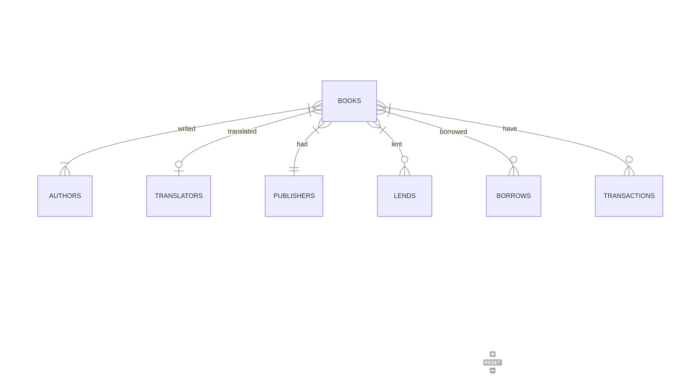

# Design Document

By Pedro de Castro

Video overview: <URL HERE>

## Scope

The purpose of this database is to allow the user to manage a personal library in a simple and effective manner. Includes all the necessary entities to help the user manage their books, loans, and transactions. The database's scope is:

* Books, including a wide range of information about them
* Authors, including basic identifying information
* Translators, including basic indentifying information
* Book lendings, including the type of loan (lend or borrow), the people involved, the time at which the loan was made, when the book was returned, as well as fines in case of delay
* Book transactions, including the type of transaction (purchase or sale), the name of people involved, the values, and the time at which the transaction was made

Out of scope are elements like personal information of the people involved, libraries and bookstores.

## Functional Requirements

In this section you should answer the following questions:

* What should a user be able to do with your database?
* What's beyond the scope of what a user should be able to do with your database?

## Representation

### Entities

In this section you should answer the following questions:

* Which entities will you choose to represent in your database?
* What attributes will those entities have?
* Why did you choose the types you did?
* Why did you choose the constraints you did?

### Relationships

In this section you should include your entity relationship diagram and describe the relationships between the entities in your database.

## Optimizations

In this section you should answer the following questions:

* Which optimizations (e.g., indexes, views) did you create? Why?

## Limitations

In this section you should answer the following questions:

* What are the limitations of your design?
* What might your database not be able to represent very well?